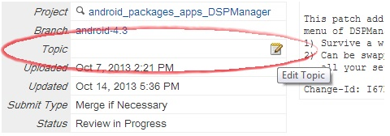

# OmniROM Documents
## Gerrit rules
### Submitting a patch

#### The contents of your patch
You should make sure you use different repo branches for your patch, to ensure you don’t have an unneeded dependency on another patch. Use `repo start` for every new changeset you make, and `repo checkout` to switch between your changes. For more on **repo** and **git** see [Using repo and git](Using_repo_and_git.md).

Your code should contain only the required changes to make your feature work. You should remove all unneeded comments (debug, commented code) and code (unneeded debug log commands, etc). Make sure your code style sticks to the [Android Guidelines](https://developer.android.com/training/index.html), and that you don’t have trailing spaces (spaces at the end of a line).

#### Work-in-progress
Commits that are work-in-progress may bypass the above paragraph, but must be clearly marked with a **[WIP]** tag at the very beginning of the commit message. This way they won’t be auto-tested by our verification bot, and testers will know your patch isn’t ready for prime time yet.

#### Formatting your commit message
The first line of your commit message should be a swift summary of your change, that should make your patch recognizable easily on Gerrit’s patch list. Think of it as a patch title.

***Good:***
- surfaceflinger: Add compatibility support for MTK
- liblights: Fix keys not lighting up on i9300
- telephony: Enhance the way CDMA is operated

***Bad:***
- MTK support
- ……!!!!!!!
- Add class1, class2, backwards compatibility, support layer and gralloc changes to make MTK chipsets (6589, 6582) working with Android 4.3

The lines following your "title" should contain a deeper explanation of what your commit changes (e.g. with answers to ‘why’ and ‘how’ for your patch). Indicating changes between different Patch Sets might be a good idea. It is possible however to give details in the comments section instead.

### Cherry-picks from other sources
In case you’re cherry-picking a patch from a trustable upstream source (the Linux kernel, AOSP, etc.), you should not change the commit message, so that we can recognize upstream patches more easily, and keep history clean. Comments should be done in the Gerrit ticket’s comment section, not in the commit message.

In addition, preserve authorship of your cherry-pick, do not change the authorship to yourself.  Authorship should automatically be preserved if you perform a `git cherry-pick` or use `git am` to apply a git-formatted patch.

#### Multi-project changes

In some cases, one feature might affect multiple projects (repositories) at once, in a way that you need to upload multiple Gerrit review tickets. In such case, your changes should follow the following naming convention:
```
[1/2] xxx: yyyyyyyyyyyyyyyyy
```
```
[2/2] xxx: yyyyyyyyyyyyyyyyy
```
As we have an automated system testing patches, you must follow that naming convention properly, and affect the same topic name to the patches going together:



### Getting Your Patch Validated
Our review process is totally open, but a few conditions may apply. In order to get your patch approved, you must ensure that:

- Your patch builds with a clean tree (and the dependencies, if any)
- Your patch follows all of the above rules
- Your patch isn’t against the laws (e.g. confidential material)
- Your patch isn’t a troll, and has an actual reason to exist

All users on Gerrit are then able to **+1**, or **-1** your patch. In case your patch introduces a big change, or if you need UI/UX/Concept feedback, we encourage you to open a ticket on [Omni’s JIRA](http://jira.omnirom.org/) in the UI Review or Concept Review projects.

### Signaling your patch is ready for review

In order to signal to potential reviewers that your patch is ready for review, you need to do a review of your own change and set it “**Code-Review: +1**”. This tells potential reviewers that the author has deemed it ready to be reviewed and allows changes to stay on gerrit while they are refined. Similarly, if you feel your patch isn’t ready, setting Code-Review to -1 immediately tells people to not bother looking at it yet.

Once the patch is signaled ready for review, it will be automatically tested by the Omni Build Verifier, which will give a Verify: +1 or -1 depending on whether your changes build successfully.

### Override of the open review process
There might be cases where an open review process can go wrong, or must be bypassed for a few reasons. Patches will be rejected or put on hold if:

- They introduce an obvious security hole
- They are trolls
- They don’t follow these guidelines and the previous rules
- They cause a massive amount of discussion between users (in this case, the discussion will be put down in another place where it can be discussed more easily).

Patches can be submitted without prior deep review if:

- They fix an important system-wide security hole
- They fix a valid legal issue (e.g. licensing)
- They fix an important system bug, or build breakage.

### Allowing merge commits

See https://code.google.com/p/gerrit/issues/detail?id=1072 if you have issues getting merge commit permissions to work in comment 6.
